# Amazon S3 Cloud Storage Configuration

## Objective
Configure an S3 bucket with public and private access while implementing security measures.

## Steps Completed
1. Created uniquely named S3 bucket with encryption

2. Configured public/private access settings

3. Implemented IAM policies

4. Generated pre-signed URLs

5. Screenshots with detailed configurations and tests

### Step 1

### Step 2

### Step 3
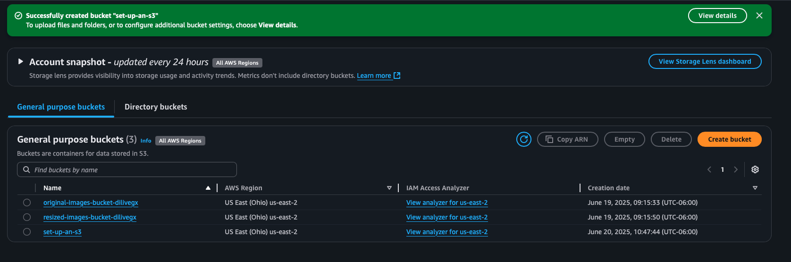

### Step 4
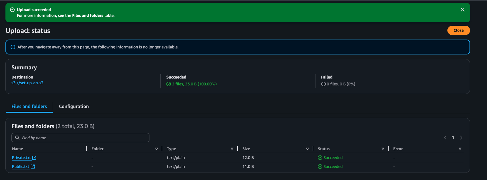

### Step 5
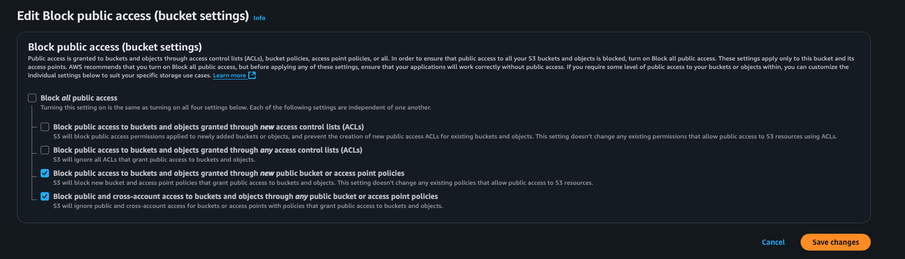

### Step 6
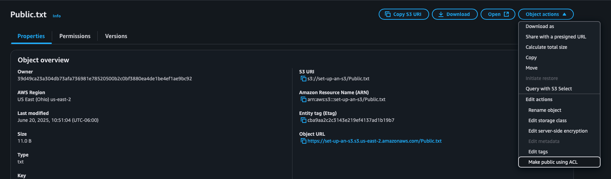

### Step 7
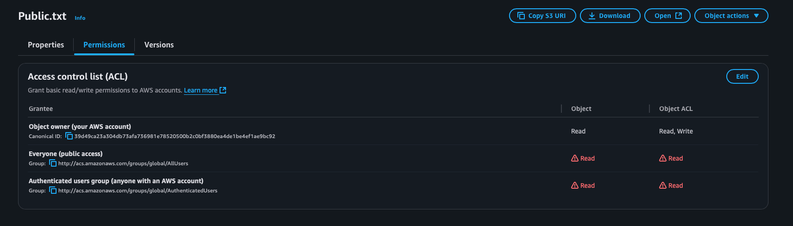

### Step 8
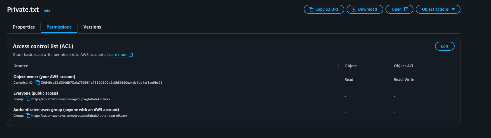

### Step 9
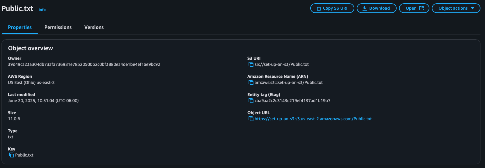

### Step 10
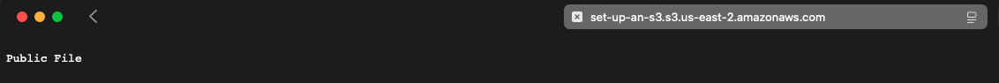

### Step 11
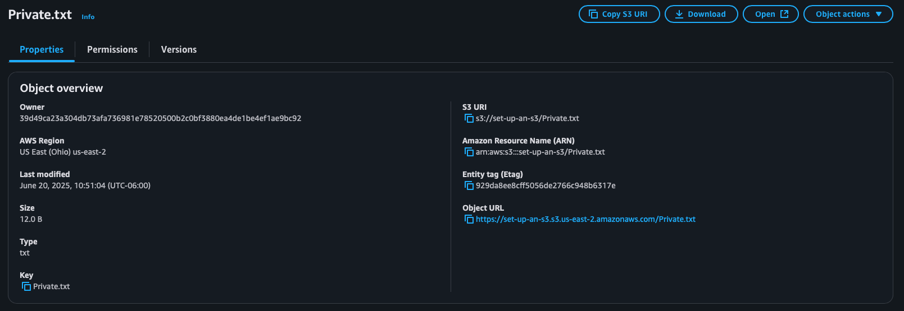

### Step 12
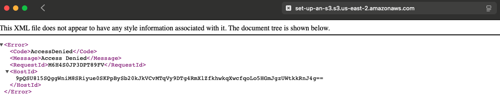

### Step 13
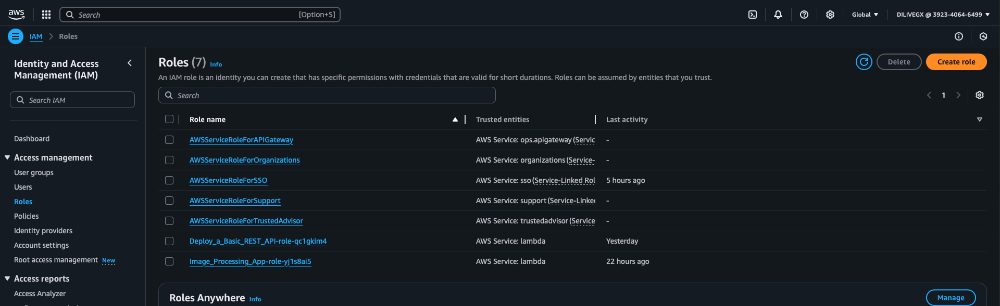

### Step 14
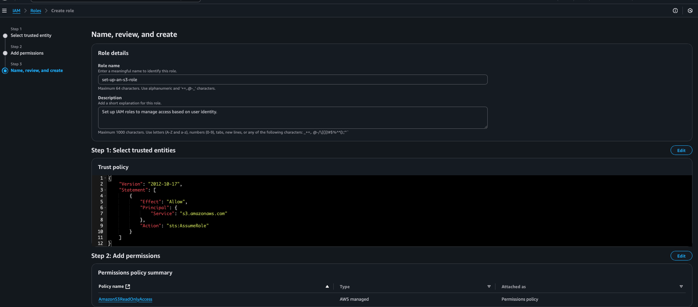

### Step 15
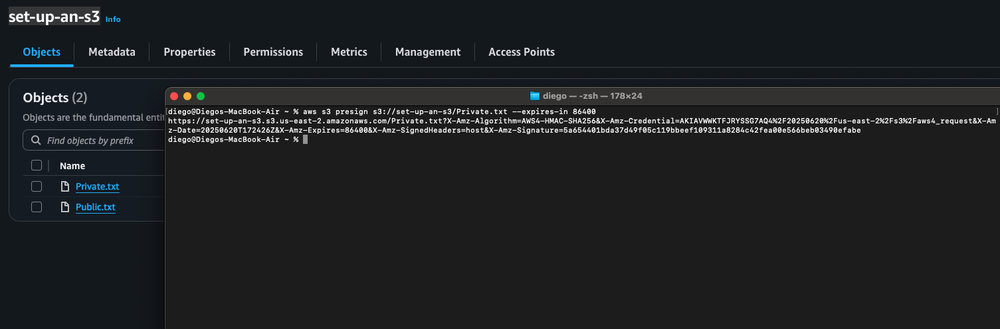

