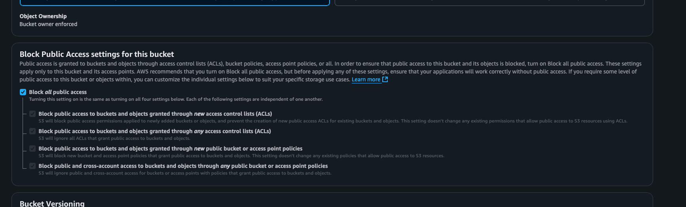

# Amazon S3 Cloud Storage Configuration

## Objective
Configure an S3 bucket with public and private access while implementing security measures.

## Steps Completed
1. Created uniquely named S3 bucket with encryption

2. Configured public/private access settings

3. Implemented IAM policies

4. Generated pre-signed URLs

5. Screenshots with detailed configurations and tests

