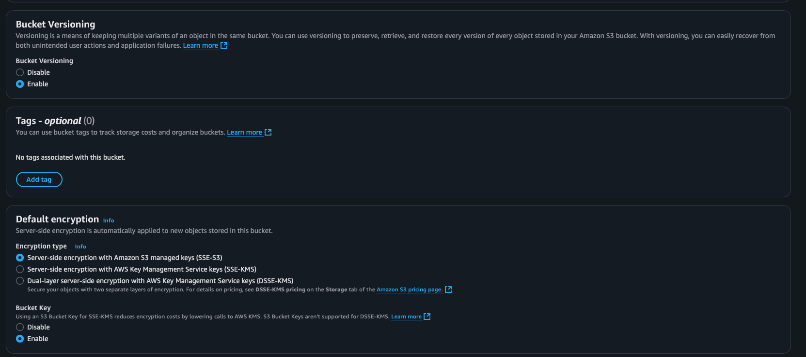

# Amazon S3 Cloud Storage Configuration

## Objective
Configure an S3 bucket with public and private access while implementing security measures.

## Steps Completed
1. Created uniquely named S3 bucket with encryption

2. Configured public/private access settings

3. Implemented IAM policies

4. Generated pre-signed URLs

5. Screenshots with detailed configurations and tests

### Step 1 - Bucket Creation

### Step 2 - Bucket Naming

### Step 3 - Region Selection

### Step 4 - Block Public Access

### Step 5 - Versioning Enable

### Step 6 - Encryption Settings

### Step 7 - Bucket Creation Complete

### Step 8 - File Upload

### Step 9 - Public Access Configuration

### Step 10 - IAM Role Creation

### Step 11 - Policy Attachment

### Step 12 - Pre-signed URL Generation

### Step 13 - Public Access Test

### Step 14 - Private Access Test

### Step 15 - Encryption Verification

